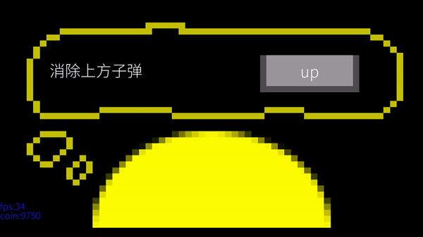

# Ehirection
## 欢迎！Welcome!
这是一款完全由我本人开发制作的音乐游戏——八方。本游戏还在beta测试阶段，遇到各种问题或者想给我提建议，欢迎提交issue！顺带一提，如果有一个更好的名字建议的话，也可以提出哦。
***
## 目录
* [分支](#分支)
* [玩法介绍](#玩法介绍)
* [大厅](#大厅)
* [设置](#玩法介绍)
* [更新记录](#更新记录)
***
## 分支
**main**：目前已更新的稳定版本。  
**release**：目前已更新的版本。  
**dev**：正在开发的版本，可能会有奇怪的bug。  
**images**：专门存储图片素材的分支。

## 如何开始？
如何开始是个好问题。如果你想得到解答，请将下列一串数字输入到QQ搜索框中。  
`482915512`  
如果你看到一个封面黑黄色的群聊，加入它，等待我或管理员同意就可以了。  
.exe文件已经放在群文件里了。  

当然，如果你想窥视源代码，直接在github里clone一下就可以了，不多说。  
## 玩法介绍
~~*音游，相信各位都不陌生，那么八方是怎么一回事呢，那么就让小编带大家一起了解一下吧。*~~  

计划会有很多种模式，但是时间和技术受限，目前版本只有一个Yellow模式。具体如图：

  
>图中中心的实心圆是玩家本身，而四周向玩家移动的实心圆是一个个`note`。  
>
>判定区域则是玩家四周的四个空心圆。  
>默认是用方向键上下左右触发判定的，如果你不喜欢这样，可以在[设置](#设置)中更改它。
>
>其他模式的布局不会像此模式一模一样，可能会有不同。

## 大厅
大厅

## 宝箱界面
宝箱界面

## 歌曲选单
歌曲选单

## 设置
当初为了更有“代入感”，设置界面专门设计成了这种样式，然而实际使用上非常的不直观，不方便。计划在下个版本中更改 ~~*（并不确定）*~~。  
图片：  

>在主界面按下`ESC`键进入，`ESC`键退出。
>
>用`方向键的上下`切换设置项目。（未加入设置）
>
>`鼠标左键单击`按钮，进入编辑状态。在编辑状态时按下要设置的按键，确定后再次点击即可。
>
>每次退出设置和关闭程序都会自动保存，不用担心没保存。

## 更新记录
2020年7月10日: 增加一个更新记录来记录更新情况
***
### beta 1.2.0:

#### 2020年7月10日(启用日):  
1.整理了图片、字体等文件，减少了硬盘内存占用量  
2.在大厅点击宝箱可以十连抽了  
3.新增了绿色品质物品：水晶(Crystal)、木棍(Stick)和绳子(Rope)，并加入奖池  
4.新增了一个物品字典(id_list)，支持通过对象的名称来查找对应的id  
5.更改了控制台信息消失的算法，从以前的匀速向上更换为以显示中的信息数量来决定速度（渐慢的效果）  
6.如果关闭再打开控制台刚才的信息不再会显示，而是被删除  

#### 2020年8月12日:  
1.更新了大厅视觉，更改为像素风格  
2.修改了谱面切换机制，现在在切换过程中再次点击会切换到下一个谱面  
3.添加了道具“苹果”的贴图  
***
### beta 1.2.1:  

#### 2020年8月12日  
1.现在能够显示当前谱面的名字、译名、时间了  

#### 2020年8月18日  
1.修改了版本号为1.2.1而不再是1.3.0  
2.修改了更新记录的位置为ehirection文件夹起始位置而不是各个版本的起始位置并删除了多余的更新记录  
3.删除了旧八方图库  
4.现在大厅可以长按来移动了  
5.游戏中控制判子的默认键位重新改为方向键了，并提高了KEYDOWN的发送频率使其降低按键冲突的概率  
6.添加了Setting模块（设置模块）并添加了一些键位的字典以及设置功能初步  
7.添加了错误报告（加载模块错误、读档错误和存档错误）  

#### 2020年8月25日
1.修复了大厅移动忽快忽慢的问题  
2.修复了在物品已经隐藏的情况下有时仍能看见物品高光的问题  
3.修改了错误报告的字体颜色并增大了字体大小。  

#### 2020年8月26日  
1.现在可以在大厅按下“Esc”键来进入设置界面，但目前不支持设置。  
2.新增了谱面“缶ビール”（罐装啤酒）  
3.现在游戏启动时和道具技能启动时不会再在控制台显示信息了  

#### 2020年8月27日  
1.现在可以设置部分键位了（包括大厅左右移动、消除子弹、打开/关闭道具栏、切换道具、游戏退出和显示/隐藏控制台消息）  
2.现在默认为全屏模式  

#### 2020年8月28日  
1.简化了部分代码  
2.添加了谱面“intro (w rook1e)”  
3.现在在修改键位时不会触发快捷键了（即F1关闭程序和m显示/隐藏控制台信息）  
4.现在默认为窗口模式  

***
### beta 1.3.0:

#### 2020年9月5日  
1.修改了控制台信息消失特效，由上移改为渐渐消失  

#### 2020年10月1日  
1.增加了陨落星光卡池  

#### 2020年10月5日  
1.修复了"FallenStarLight"的语法错误，现为"FallingStarLight"  

#### 2020年10月8日  
1.增加了抽奖特效  

#### 2020年10月18日  
1.抽奖特效优化，现在更加美观  
2.物品栏不再默认全图鉴，而是与存档互通  
3.材料（Material）类物品可堆叠，并在物品栏中显示数量  

#### 2020年11月8日  
1.修复了血量小于等于0时无法结算的问题  

#### 2021年2月  
1.修改了部分动画表现，使其更加顺滑（非线性动画）  

#### 2021年3月14日  
1.适配新版谱面数据  
2.优化note到达判定区域的时间  

#### 2021年5月2日  
1.将旧版谱面数据更新为新版，并弃用旧版  
2.优化了谱面切换机制，使其更加符合玩家操作习惯。  

#### 2021年5月3日  
1.删除了旧的歌曲选单类。  
2.修复了第一次进入选单时歌曲标题、副标题、时长无法正确显示的问题。  
3.代码上添加了一个gameInit()方法，使游戏初始化这个过程更加清晰  

***

### beta 1.4.0:

#### 2021年5月5日 develop 1.4.0.1

1.Crystal现在有一个技能：标记距离最近的一个note  
2.现在Update界面上方会显示判定结果了  

#### 2021年5月30日 develop 1.4.0.2

1.更换了设置界面的样式，使界面更直观  
2.修复了宝箱加载界面、宝箱抽取界面中的宝箱位置以及按钮位置错位的问题  
3.修复了更新记录中"beta1.4.0"未显示的问题  

#### 2021年6月6日  develop 1.4.0.3

1.添加了一个一键切换新旧设置界面布局的功能。  
2.减小了判定区域与中心（Hero）的距离，使之与过去一致。  
3.添加了一个显示连击数（Combo）的功能，并将其与判定结果共同显示在屏幕右上角。  
4.修改了在代码内的版本号，使其与当前版本一致。（以后的更新记录略）  

#### 2021年6月19日

1.添加了数首主界面背景音乐。  

#### 2021年6月30日

1.给note添加了泛光效果。  
2.修复了betaMessage中的语法错误（If you met them... => If you meet them...）  

#### 2021年7月2日

1.减弱了泛光效果使视觉上更加合适。  
2.由于加载时间变长，加入了加载界面与进入动画。  
3.修复了如果屏幕过小，唱片会重叠的问题。  
4.取消了标题上的fps显示。  
5.更改了版本号命名规则。 develop表示正在开发的版本 beta表示相对稳定的测试版本 release表示正式版本。1.a.b.c 1.a.b表示当前版本 c表示这是develop版本的第几次更新。  
6.补充了beta 1.3.0.8的“3.增加了note的打击音效”  

#### 2021年7月3日

1.添加了一个index.py用来启动游戏而不是直接用eightDirection.py。这将减轻打包压力。  
2.修改了算法使在一些条件下唱片会重叠的问题。并将record_dis变得可自定义（代码层面上）。  
3.在设置界面添加了一项“切换全屏模式和窗口模式”，但未添加具体功能。  

#### 2021年7月4日 develop 1.4.0.4

1.添加了功能“切换全屏模式和窗口模式”  
2.更改了设置界面样式的值。从“Old”和“New”改为“False”与“True”  

## 关于我
要给项目提建议直接提交issue即可  
QQ号：1185557481 不过QQ我不常上
b站：
