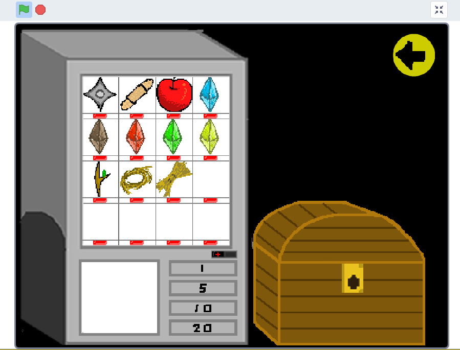

# Ehirection
## 你好，开发者！
就如名字所告诉我们的一样，这个分支存放着正在持续更新的测试版本。如果你是一个只想玩游戏的普通玩家，那么我建议去release分支clone文件或者直接进入QQ群`482915512`  下载.exe文件。    

太好了，如果你没有切换分支，说明你想要了解未来开发方向甚至是加入开发。以下会有你想要的信息：

## 目录

* [开发方向](#开发方向)

* [加入开发](#加入开发)

## 开发方向

如您所见，八方目前还是一个非常瘸腿的游戏，这里少少那里少少，甚至包括灵感也很少。并且一直都是我一个人在开发，进度十分缓慢。所以规划并不会规划的十分紧促，第一是考虑到生产力，第二是考虑到本人的学业。  

**1、便利柜系统（商店）**

当您在游玩游戏的时候，会发现大厅宝箱的左边有一个奇怪的巨大的灰色的长方体，那其实是便利柜的贴图，只不过还没有细化。  

便利柜是一个诞生之初就有打算的一个东西，甚至于我古早时期的scratch版本的八方已经做出来了，不过并不好看。如图：

> ~~*为了得到我以前的scratch文件我甚至差点给百度网盘付钱，最后想到我的老硬盘里不就有吗*~~

**2、活动系统**

本来是要在2021年弄进来的，结果到现在也没有做出来，当然是因为我太懒了。

有几个小活动比如说元旦的，春节的。内容也就是限时谱面，限时道具，或者说小游戏之类的，原谅我脑细胞不够用。

大的活动会有夏活，东西会更多，之前还想过要跟剧情一起出，结果你懂得。

**3、剧情**

主大厅的左右移动并不是物品在滑动，而其实是一个人在走动，那个人就是主角。虽然说现在没有贴图，但是剧情方面其实已经构思很久了，也差不多了（仅限于大脑中）。

一想想那些场景，对话，甚至交互，我就感觉到肝痛......

**4、设置界面**

虽然说我刚刚把设置界面的样式改的更加直观得多，但是我加上那背景变灰的效果之后，突然发现：为什么不留两种样式供玩家选择？但是我想到这个的时候，以前的代码已经基本取代掉了。兴许以后再把旧的Setting.py复制一个过来直接在index文件（代码根本就没有整理，所以叫ehirection.py）中用两个调用方法就可以了。

**5、完善结算界面**

目前的结算界面并不完善，既没有显示perfect等判定结果的个数，也没有判定等级。并且我甚至想完全改掉结算界面的样式。

**6、代码整理**

index文件，或者叫ehirection.py中被一大堆本应该在一个个单独文件中的类占据了数百行，每次翻来翻去真的很麻烦。而且考虑到分文件之后扩展的问题，我想新建一个文件来管理那些全局变量。（以前就想过但是没成功）

## 加入开发

加入QQ群`482915512`或者直接通过我自己的QQ`11857481`联系我就可以。

听起来真简单。
